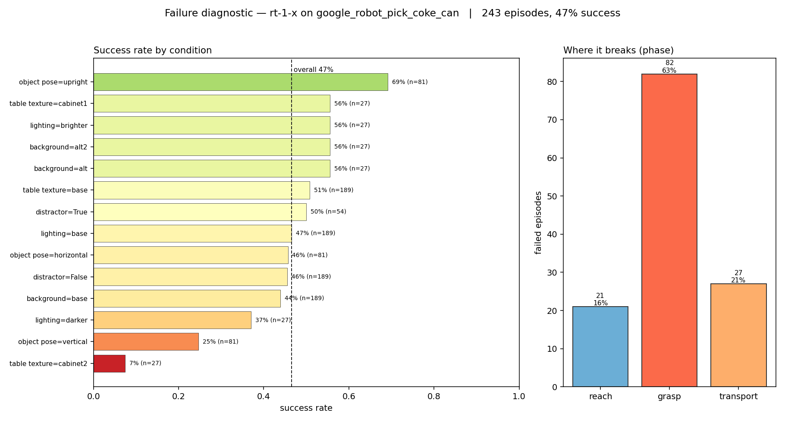
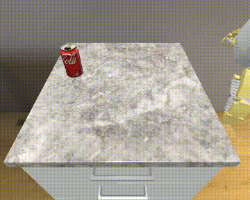
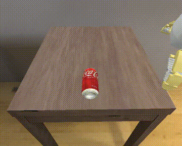

# robot-eval-diagnostics

A failure-mode diagnostic layer for robot manipulation policies. Built on open VLA/RT policies and SimplerEnv.

Most robot policy evaluation reports a single number: success rate. That number tells you whether a policy is good. It does not tell you *where* it fails, *why*, or *what data would fix it*. This project builds the layer that answers those questions.

## What it does

Takes an off-the-shelf manipulation policy, runs it across a sweep of simulated conditions, and produces a one-page diagnostic instead of a scalar:

- Overall success rate (the headline everyone already reports)
- Failure decomposition by environment condition and by failure phase
- A concrete data-collection recommendation for each dominant failure cluster

## Result

RT-1-X on `google_robot_pick_coke_can`, 243 episodes across the SimplerEnv variant-aggregation sweep (backgrounds, lighting, distractors, table textures, object poses):



The scalar — **47% success** — hides everything the decomposition surfaces:

- **The policy mostly breaks at the grasp phase** (63% of all failures), not reach or transport.
- **`cabinet2` table texture collapses it to 7%** (vs ~51% on the default table) — the single largest driver.
- **Vertically-laid cans drop it to 25%** (vs 69% upright).
- Distractors barely move it; lighting matters a little (darker −10pts).

Actionable readout: *collect grasp-phase demonstrations on the cabinet2-style table surface and for vertically-oriented cans.* The full report is in [`results/report.md`](results/report.md).

## The policy in action

The diagnostic says failures concentrate at the **grasp** phase. Here it is on two rollouts — the policy reaches the can fine in both, and the outcome turns on whether it closes a stable grasp:

| ✅ Success | ❌ Failure — grasp phase |
|---|---|
|  |  |
| Clean reach → grasp → lift. | Reaches the can, but the grasp never holds — exactly the phase the report flags. |

Full clips: [`rt1_cabinet2_success.mp4`](results/videos/rt1_cabinet2_success.mp4) · [`rt1_vertical_fail.mp4`](results/videos/rt1_vertical_fail.mp4)

## How it's built

One seam matters: the line between the simulator harness and the diagnostic layer.

- **`runner/`** talks to SimplerEnv, runs the variant sweep, and emits one JSONL record per episode. Depends on the sim, a GPU, and finicky rendering libs.
- **`diagnostics/`** reads those records and produces the analysis. Depends on nothing but pandas and the standard library, and never imports SimplerEnv.

Each record's provenance is deliberate: the **condition labels are injected** from the sweep driver (the sim doesn't expose the active variant cleanly, so the runner stamps in what it knows it's running), the **end-effector trajectory is accumulated** per step during the rollout, and **success comes from the simulator's own ground-truth** episode stats — not a heuristic. The failure-phase labels are then derived from generic `grasped` / `lifted` outcome signals, so the diagnostics never depend on anything sim-specific.

They communicate only through JSONL rollout records on disk. That keeps the diagnostic layer — the differentiated part — policy- and source-agnostic: the same code would run on records from a different simulator, real hardware logs, or a learned world model. It's developed and unit-tested against synthetic fixtures with a *planted* failure pattern, so the whole analysis path is proven to recover a known answer before any real rollout exists.

## Stack

- **Policy:** RT-1-X (headline). The harness also runs Octo-Base — useful finding: Octo-Base scores ~0% on this task under *variant aggregation*, so it's a poor demo policy here (its ~17% figure is the easier *visual-matching* mode).
- **Sim / harness:** SimplerEnv via the [`DelinQu/SimplerEnv-OpenVLA`](https://github.com/DelinQu/SimplerEnv-OpenVLA) fork (Google Robot setup, variant aggregation).
- **Diagnostic layer:** pure Python (pandas + stdlib), no sim or GPU dependency.

## Layout

```
runner/        thin wrapper over SimplerEnv; emits rollout records
diagnostics/   schema, failure tagging, pattern surfacing, report + figure
results/       the generated one-page report and figure
data/          JSONL rollout records (gitignored)
tests/         fixture-recovery tests for the diagnostics path
```

## Reproduce

```bash
# diagnostics only (no GPU/sim) — runs anywhere
pip install -e .[dev]
pytest                                   # fixture-recovery tests
python -m diagnostics.report             # report from synthetic fixtures

# full pipeline (needs SimplerEnv + GPU)
python runner/run_octo_sweep.py --policy rt1 --ckpt <rt1_savedmodel> --grid 3x3
python -m diagnostics.report --data data/rollouts.jsonl --out results/report.md
python -m diagnostics.figure --data data/rollouts.jsonl --out results/diagnostic.png
```
